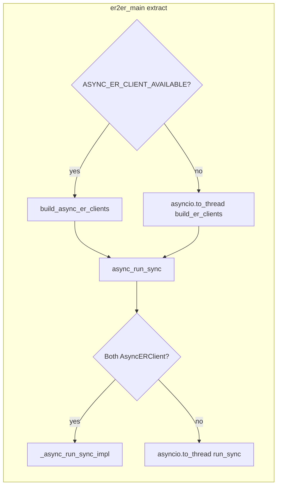

# Purely async er2er

## Current flow

After the change: only the top/left path (async clients + `_async_run_sync_impl`). No `to_thread`, no sync fallback.

## 1. Require AsyncERClient in [er2er_main.py](cdip-integrations/er2er/er2er_main.py)

- **Remove** the `else` branch (lines 91–99) that calls `asyncio.to_thread(build_er_clients, ...)`.
- **Require async:** When `ASYNC_ER_CLIENT_AVAILABLE` is false, raise a clear error before building clients (e.g. `ER2ERSync_ConfigError` or `RuntimeError`) with a message that AsyncERClient is required (e.g. "er-client async support is required; AsyncERClient could not be imported").
- **Remove** the `build_er_clients` import from `er2er_syncher`.
- **Keep** the `if ASYNC_ER_CLIENT_AVAILABLE:` block but change it to: always call `build_async_er_clients`; if the flag is false, raise instead of falling back.

Result: connector only builds async clients and fails fast if async is unavailable.

## 2. Require AsyncERClient in [er2er_syncher.py](cdip-integrations/er2er/er2er_syncher.py) `async_run_sync`

- **Remove** the fallback that runs `run_sync` via `asyncio.to_thread` (lines 1500–1508).
- **Require async clients:** If either client is not an `AsyncERClient` (or `AsyncERClient` is None), raise a clear error (e.g. `TypeError` or `ER2ERSync_ConfigError`) stating that both clients must be AsyncERClient instances.
- **Update** the `async_run_sync` docstring to say it requires AsyncERClient instances and no longer mentions a thread-pool fallback.

Result: `async_run_sync` is purely async; no `to_thread`.

## 3. Optional: remove sync-only code from er2er_syncher

After (1) and (2), nothing in this repo calls `run_sync` or `build_er_clients`. [event_type_copy.py](cdip-integrations/er2er/event_type_copy.py) uses its own `ER2ER_Syncher` and sync `ERClient`; it does not import `run_sync` or `build_er_clients`.

You can either:

- **Keep** `run_sync`, `build_er_clients`, and the sync helpers (e.g. for a future CLI or tests), or  
- **Remove** them as dead code: `run_sync`, `build_er_clients`, and the sync-only helpers used only by `run_sync`: `get_events_since_io`, `get_event_types_io`, `get_event_categories_io`, `sync_event_categories_io`, `sync_event_types_io`, `sync_events_io`, `copy_files_between_events_io`, `remove_files_from_event_io`, `create_dest_event_io`, `update_dest_event_io`. Pure helpers and shared types (e.g. `clean_event`, `SyncConfig`, `SyncResult`, `build_dest_event_sources`) stay; they are used by the async path.

Recommendation: do (1) and (2) first; then decide whether to delete the sync-only functions in a follow-up.

## Summary

| File                                                                    | Change                                                                                                                                     |
| ----------------------------------------------------------------------- | ------------------------------------------------------------------------------------------------------------------------------------------ |
| [er2er_main.py](cdip-integrations/er2er/er2er_main.py)                  | Require AsyncERClient; remove `build_er_clients` import and `asyncio.to_thread(build_er_clients, ...)` branch; raise if async unavailable. |
| [er2er_syncher.py](cdip-integrations/er2er/er2er_syncher.py)            | In `async_run_sync`, remove `asyncio.to_thread(run_sync, ...)`; require both clients to be AsyncERClient; update docstring.                |
| [er2er_syncher.py](cdip-integrations/er2er/er2er_syncher.py) (optional) | Remove `run_sync`, `build_er_clients`, and sync-only I/O helpers listed above.                                                             |

No changes to [event_type_copy.py](cdip-integrations/er2er/event_type_copy.py); it remains sync-only and does not use the removed code.
